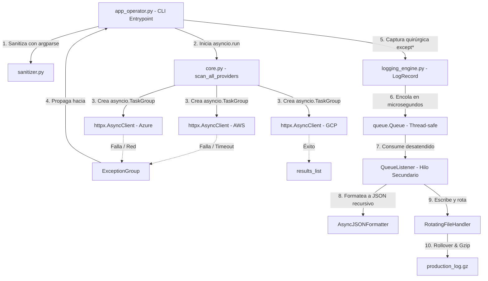

# TritonMonitor — Sistema de Telemetría Multicloud y Observabilidad Asíncrona

CLI de observabilidad para **Triton Cloud Services**, que monitorea en
paralelo el estado operativo de tres proveedores cloud (AWS, Azure, GCP)
consumiendo APIs reales de internet (`httpx` + `asyncio`), con manejo
quirúrgico de fallos concurrentes (`ExceptionGroup` / `except*`) y un
pipeline de logging JSON forense, asíncrono y no bloqueante.

## Integrantes y roles

| Rol | Módulo(s) | Responsable |
|---|---|---|
| Ingeniero de Robustez de Entradas y Excepciones | `exceptions.py`, `sanitizer.py` | _(completar)_ |
| Ingeniero de Concurrencia y Telemetría Asíncrona | `core.py` | _(completar)_ |
| Ingeniero de Formateo Estructurado JSON | `logging_engine.py` (`AsyncJSONFormatter`) | _(completar)_ |
| Ingeniero de Almacenamiento y Desacoplamiento No Bloqueante | `logging_engine.py` (pipeline `QueueHandler`/`QueueListener`) | _(completar)_ |
| Coordinador de Integración y Flujo CLI | `app_operator.py` | _(completar)_ |
| Ingeniero de Simulación de Caos y Pruebas Forenses (opcional) | suite de pruebas | _(completar)_ |

## Instalación

```bash
python3 -m venv .venv
source .venv/bin/activate          # En Windows: .venv\Scripts\activate
pip install -r requirements.txt
```

## Uso

```bash
cd src
python app_operator.py --timeout 2.0
python app_operator.py --timeout 1.0 --mode debug
python app_operator.py --cluster cluster-us-east-01 --mode emergency
```

Argumentos:

- `--timeout [0.1-5.0]`: timeout en segundos para las consultas HTTP asíncronas.
- `--cluster cluster-<region>-<numero>`: identificador opcional de clúster.
- `--mode {nominal,debug,emergency}`: modo operativo.
  - `nominal`: chequeo estándar de los 3 proveedores.
  - `debug`: inyecta fallos de caos controlados (timeout + status HTTP de error) junto a las consultas nominales.
  - `emergency`: fuerza un timeout agresivo para estresar la resiliencia.
- `--quiet` / `--verbose`: grupo mutuamente excluyente de salida de texto.

Los logs estructurados en JSON se escriben en `production_log.log`, con
rotación automática a los 2 MB (hasta 3 backups) y compresión Gzip en
caliente de cada archivo rotado (`production_log.log.1.gz`, etc.).

## 4.1. Diagrama de Arquitectura de Telemetría (Mermaid)



## Estructura del proyecto

```
triton_monitor/
├── src/
│   ├── triton_telemetry/
│   │   ├── __init__.py        # Expone la API pública del paquete mediante __all__
│   │   ├── exceptions.py      # Excepciones semánticas custom de Triton (no BaseException)
│   │   ├── sanitizer.py       # Validación de parámetros CLI (argparse)
│   │   ├── core.py            # Lógica asíncrona de consulta HTTP (asyncio + httpx)
│   │   └── logging_engine.py  # Formateador JSON avanzado y pipeline asíncrono no bloqueante
│   └── app_operator.py        # Punto de entrada CLI ejecutable (argparse + except*)
├── requirements.txt           # Dependencias aisladas del proyecto (httpx)
└── README.md                  # Este documento
```


## Guía de Pruebas de Integración y Validación de la Telemetría

### Escenario A: Operación Nominal Completa (Éxito Rotundo)

```bash
python src/app_operator.py --timeout 3.0 --mode nominal
```

Resultado esperado: las tres consultas a `jsonplaceholder.typicode.com`
responden con éxito (`HTTP 200`), no se genera ningún `ExceptionGroup`, y
`production_log.log` registra un evento `INFO` de finalización exitosa.

### Escenario B: Validación Temprana de Argumentos Fallida (Frontera CLI)

```bash
python src/app_operator.py --timeout 99
python src/app_operator.py --cluster clusterinvalido
```

Resultado esperado: `sanitizer.py` lanza `argparse.ArgumentTypeError`
antes de que se inicie cualquier lógica asíncrona o de red la CLI
termina limpiamente con código de salida **2**, sin llegar a tocar el
bucle de eventos.

### Escenario C: Inyección de Caos (Fallos Concurrentes y Árbol ExceptionGroup)

```bash
python src/app_operator.py --timeout 1.0 --mode debug
python src/app_operator.py --mode emergency
```

Resultado esperado: se disparan fallos reales de red (timeout real contra
`httpbin.org/delay/3` y status codes de error como `504`/`422`), que
`asyncio.TaskGroup` agrupa en un único `ExceptionGroup`. Los bloques
`except*` de `app_operator.py` capturan de forma quirúrgica cada tipo de
fallo por separado, la aplicación **no se cierra abruptamente**, y
`production_log.log` registra el árbol completo de excepciones
(sub-excepciones, causas raíz encadenadas y notas forenses de
`add_note()`) en formato JSON.

